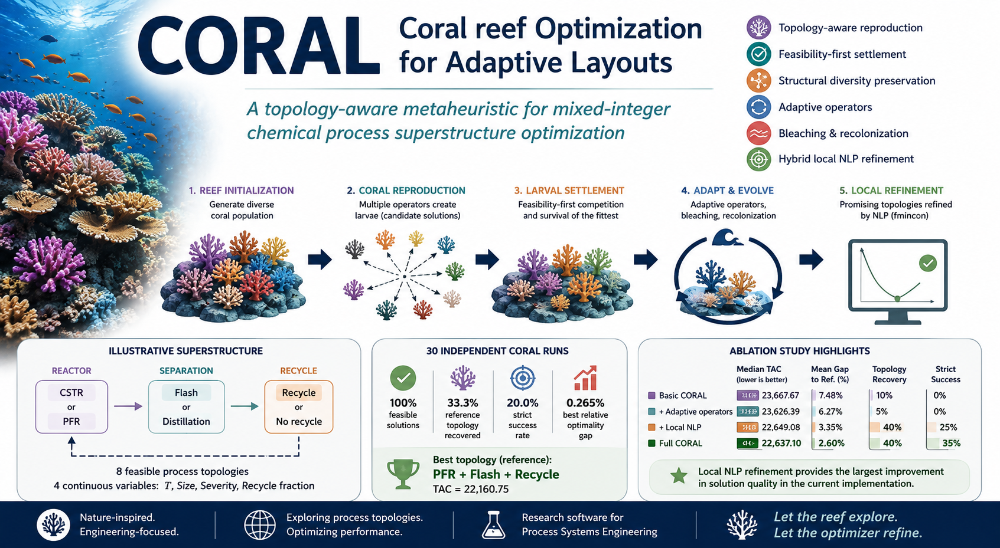

# CORAL

**Coral reef Optimization for Adaptive Layouts**

A topology-aware, coral-reef-inspired optimization algorithm for mixed-integer chemical process superstructure optimization.

> **Research software for Process Systems Engineering (PSE)**  
> CORAL combines global exploration of alternative process structures with deterministic refinement of continuous operating variables.

---

## Overview

CORAL is a mixed-variable optimization framework designed for Process Systems Engineering problems in which **discrete flowsheet topology decisions** must be optimized together with **continuous design and operating variables**.

The algorithm takes inspiration from the growth, reproduction, competition, settlement, and bleaching processes observed in coral reefs.

A candidate solution — a *coral* — is represented as:

`C_i = (y_i, x_i, f_i, V_i)`

where:

- `y_i` contains discrete process-topology decisions;
- `x_i` contains continuous design and operating variables;
- `f_i` is the objective-function value;
- `V_i` is the total constraint violation.

The central idea is to let the reef explore competing process structures while deterministic nonlinear optimization can refine promising continuous designs.

---

## Main features

CORAL combines several mechanisms within a single optimization framework:

- **Topology-aware reproduction**  
  Discrete process structures and continuous operating variables are treated differently during reproduction.

- **Feasibility-first larval settlement**  
  Feasible solutions dominate infeasible solutions. Between feasible solutions, objective value determines competition.

- **Structural diversity preservation**  
  Hamming distance between topology vectors is used to help maintain competing process configurations in the reef.

- **Multiple reproductive mechanisms**  
  Broadcast spawning, brooding, topology mutation, differential variation, and budding provide complementary search behavior.

- **Adaptive operator selection**  
  Reproductive probabilities can adapt according to their observed settlement success.

- **Bleaching and recolonization**  
  Loss of structural diversity can trigger partial reef destruction followed by recolonization.

- **Hybrid local optimization**  
  Promising process topologies can be refined using deterministic nonlinear programming (`fmincon`).

---

## CORAL optimization philosophy

CORAL explicitly distinguishes between two fundamentally different decisions in process synthesis:

```text
          GLOBAL SEARCH
     Process topology exploration
                |
                v
        CORAL reef dynamics
                |
                v
       Promising topology
                |
                v
       LOCAL OPTIMIZATION
   Continuous design refinement
          using NLP/SQP
```

Rather than asking a stochastic optimizer to perform fine continuous optimization, CORAL can use the reef to explore **which process should be built**, while a deterministic solver determines **how that process should be operated**.

---

## Illustrative process superstructure

The current validation benchmark considers a reactor-separator-recycle superstructure containing:

### Reactor alternatives

- CSTR
- PFR

### Separation alternatives

- Flash
- Distillation

### Recycle decision

- Recycle
- No recycle

The continuous decision variables are:

- reactor temperature;
- reactor size;
- separator severity;
- recycle fraction.

The resulting superstructure contains **eight admissible process topologies**.

The exhaustive reference calculation identifies:

**PFR + Flash + Recycle**

as the best feasible topology, with:

**TAC = 22,160.75**

The reference solution is obtained independently by topology enumeration combined with multistart nonlinear programming.

---

## Benchmark results

Thirty independent CORAL runs were performed for the illustrative superstructure.

| Performance measure | Result |
|---|---:|
| Feasible final solutions | 30 / 30 |
| Feasibility rate | 100% |
| Reference topology recovered | 10 / 30 |
| Topology recovery rate | 33.3% |
| Strict successful runs | 6 / 30 |
| Strict success rate | 20.0% |
| Best relative optimality gap | 0.265% |

A run is classified as **strictly successful** when:

1. the final solution is feasible;
2. the reference topology is recovered; and
3. the objective value lies within 0.5% of the reference solution.

The final topology distribution was:

```text
PFR + Distillation + Recycle     18 runs
PFR + Flash + Recycle            10 runs
CSTR + Flash + Recycle            2 runs
```

Recycle was selected in every run, while a PFR was selected in 28 of 30 runs.

---

## Ablation study

Four CORAL configurations were compared to determine which algorithmic components contribute most strongly to performance:

| Configuration | Median TAC | Mean gap | Topology recovery | Strict success |
|---|---:|---:|---:|---:|
| Basic CORAL | 23,667.67 | 7.48% | 10% | 0% |
| + Adaptive operators | 23,626.39 | 6.27% | 5% | 0% |
| + Local NLP | 22,649.08 | 3.35% | 40% | 25% |
| **Full CORAL** | **22,637.10** | **2.60%** | **40%** | **35%** |

The results indicate that **local nonlinear-programming refinement is the dominant performance-enhancing component** in the present implementation.

This improvement comes at increased computational cost and therefore represents a quality-versus-runtime trade-off.

---

## Repository structure

```text
CORAL/
│
├── src/
│   └── CORALSuperstructureOptimizer.m
│
├── examples/
│   ├── simple_process_superstructure.m
│   ├── example_CORAL_superstructure.m
│   └── example_CORAL_reef_animation.m
│
├── benchmarks/
│   ├── exhaustive_superstructure_reference_fixed.m
│   ├── benchmark_CORAL_superstructure_fixed.m
│   └── benchmark_CORAL_ablation_fixed.m
│
├── data/
│   ├── CORAL_ablation_summary_fixed.csv
│   ├── CORAL_benchmark_runs_fixed.csv
│   ├── CORAL_reference_topologies_fixed.csv
│   └── CORAL_topology_frequencies_fixed.csv
│
├── figures/
│   └── manuscript and benchmark figures
│
├── visualization/
│   ├── animate_CORAL_reef.m
│   └── CORALSuperstructureOptimizerViz.m
│
├── media/
│   └── CORAL_reef_growth.mp4
│
├── docs/
│
├── README.md
└── LICENSE
```

---

## Requirements

The current implementation was developed in MATLAB.

### Required

- MATLAB

### Required for local refinement and reference calculations

- MATLAB Optimization Toolbox
- `fmincon`

The global CORAL search can also be used without local NLP refinement.

---

## Quick start

Clone or download the repository.

In MATLAB, navigate to the CORAL repository and add the relevant folders to the path:

```matlab
addpath('src')
addpath('examples')
addpath('benchmarks')
addpath('visualization')
```

### Run the illustrative example

```matlab
example_CORAL_superstructure
```

### Calculate the exhaustive reference solution

```matlab
reference = exhaustive_superstructure_reference_fixed;
```

### Run the 30-run CORAL benchmark

```matlab
benchmark_CORAL_superstructure_fixed
```

### Run the ablation study

```matlab
benchmark_CORAL_ablation_fixed
```

### Run the reef-evolution animation

```matlab
example_CORAL_reef_animation
```

The visualization example records the reef state and biological events during optimization.

To replay the recorded reef:

```matlab
animate_CORAL_reef(result)
```

To export the animation as an MP4:

```matlab
animate_CORAL_reef(result, ...
    'FramePause',0.10, ...
    'FrameStep',1, ...
    'ShowEvents',true, ...
    'SaveVideo',true, ...
    'VideoFile','CORAL_reef_growth.mp4');
```

The benchmark scripts generate CSV files containing the computational results.

---

## Reproducibility

The repository contains:

- the CORAL optimizer;
- the illustrative process model;
- the exhaustive reference calculation;
- repeated stochastic benchmark scripts;
- the ablation study;
- raw benchmark results;
- manuscript figures;
- reef-history recording and visualization tools;
- an example reef-evolution animation.

Random seeds are explicitly specified in the benchmark scripts to support reproducibility.

---

## Figures

The `figures/` directory contains the figures used to analyze CORAL, including:

- the process superstructure;
- repeated-run performance;
- median convergence behavior;
- relative optimality gaps;
- final topology frequencies;
- ablation-study performance.

These figures correspond to the computational data contained in the `data/` directory.

---

## Watch CORAL evolve

CORAL can record and visualize the evolution of the optimization reef during a run.

▶️ **[Watch the CORAL reef evolve](media/CORAL_reef_growth.mp4)**

In the animation, the optimization population is represented as an evolving reef:

- **Each coral** represents one candidate process design.
- **Color** represents process topology — effectively a different coral *species* within the process superstructure.
- **Marker size** represents solution quality; larger corals correspond to better-performing solutions.
- **Filled markers** represent feasible process designs.
- **Open markers** represent infeasible process designs.
- **Green rings** indicate newly settled larvae or budding events.
- **Red crosses** indicate depredation or bleaching events.

As the iterations proceed, alternative process topologies compete for space. Successful structures can spread through the reef, weaker candidates disappear, and diversity-preserving disturbances can create space for recolonization.

The animation therefore provides a visual correspondence between:

```text
ecological evolution of the reef
              ↕
mathematical search of the process superstructure
```

The visualization is generated using:

```text
visualization/animate_CORAL_reef.m
visualization/CORALSuperstructureOptimizerViz.m
examples/example_CORAL_reef_animation.m
```

Reef-history recording is optional so that the standard optimizer can be used without the additional memory required to store every population snapshot.

---

## Research status

**CORAL is currently research software under active development.**

The present reactor-separator-recycle problem is deliberately small so that all process topologies can be independently enumerated and optimized.

The current results should therefore be interpreted as **algorithm validation**, rather than evidence that CORAL is generally superior to other metaheuristics or deterministic MINLP methods.

---

## Future development

Planned developments include:

- evaluation on established chemical process-synthesis benchmarks;
- comparison with Genetic Algorithms (GA);
- comparison with Differential Evolution (DE);
- comparison with conventional Coral Reefs Optimization (CRO);
- comparison with deterministic MINLP solvers;
- connectivity-aware topology mutation;
- graph-based structural similarity;
- adaptive local-refinement strategies;
- larger process superstructures;
- heat-integration and recycle-network problems.

---

## Associated manuscript

A manuscript describing the CORAL methodology and initial computational experiments is currently in preparation:

**CORAL: A Topology-Aware Coral-Reef Algorithm for Mixed-Integer Chemical Process Superstructure Optimization**

E. Zondervan

University of Twente, The Netherlands

Publication details and DOI will be added following acceptance/publication.

---

## Citation

If you use CORAL in research, please cite the associated publication once available.

A `CITATION.cff` file and permanent software DOI will be provided with the first archived release.

---

## License

CORAL is distributed under the **MIT License**.

See the `LICENSE` file for details.

---

## Author

**Edwin Zondervan**  
Sustainable Process Technology  
Process Systems Engineering  
University of Twente  
The Netherlands

---

## Project links

- 🌐 [CORAL project website](https://sinnomius.github.io/CORAL/)
- 💻 [Source code and releases](https://github.com/sinnomius/CORAL)

## Disclaimer

CORAL is research software. It is provided for scientific and educational use and comes without warranty. Results should be independently verified before the software is used for engineering design or decision-making.
